  

# 🏢 Awesome Conference Room Scheduling 📅

  
  
  
  
  

## 🌐 Top Conference Room Scheduling & Desk Booking Platforms Ecosystem 🚀

**Curated Directory of SaaS Products, Workspace Management Tools & Self-Hosted Open-Source GitHub Projects**

*Focused on Meeting Room Booking Systems, Desk Reservations, Hybrid Workplace Analytics & Office Resource Scheduling*

**Last updated: September 2026** 📅

---

This repository tracks notable **SaaS platforms** and **open-source projects** for **Conference Room Scheduling**, **Desk Booking**, and **Workspace Management**. These solutions help facility managers, IT administrators, and enterprise operations teams optimize office space utilization, manage hybrid office desk check-ins, and deploy touch-screen digital door displays outside meeting rooms.

---

## 💡 Market Insights & Industry Overview 📊

> 📈 **Estimated Sector Market Size:** The global Workplace Management & Meeting Room Scheduling Software market is estimated at **$5.2 Billion USD (2026)** and is projected to expand at a CAGR of 12.8% through 2030, driven by global hybrid work adoption and office footprint optimization.
>
> 🧩 **Market Fragmentation:** The sector is **moderately fragmented**. While enterprise workplace experience suites (such as Eptura/Condeco and Robin) dominate large fortune-500 deployments, the market features strong niche software players (Joan, Skedda, YArooms) alongside a vibrant ecosystem of self-hosted open-source solutions catering to privacy-conscious enterprises, universities, and public institutions.

---

## 📑 Table of Contents

- [🏢 SaaS / Hosted Platforms](#-saas--hosted-platforms)
- [⚡ Open-Source GitHub Projects](#-open-source-github-projects)
- [📂 Categorized Open-Source Matrix](#-categorized-open-source-matrix)
- [🤝 How to Contribute](#-how-to-contribute)
- [💖 Support & Sponsorship](#-support--sponsorship)
- [📈 Star History](#-star-history)
- [⚠️ Disclaimer](#%EF%B8%8F-disclaimer)

---

## 🏢 SaaS / Hosted Platforms

Below is a comparison of top cloud-hosted workplace scheduling software, categorized by market cap, valuation/funding size, specific pricing structures, and free trial / free tier terms.

| Platform / Vendor 🏢 | Company Size / Valuation / Funding 💰 | Starting Pricing Tier 💵 | Free Tier / Free Trial Limits ⏳ | Key Features & Focus 🌟 |
| :--- | :--- | :--- | :--- | :--- |
| **[Teem by iOFFICE](https://www.iofficecorp.com/)** | **Part of Eptura ($1B+ Valuation / Private Equity)** | Starts at **$8.00 / desk / month** or **$25.00 / room / month** | **14-day free trial** with full access to room display app & desk booking | Enterprise workplace management, digital signage displays, room analytics, and Microsoft 365 / Google Workspace integrations. |
| **[Condeco](https://www.condeco.com/)** | **Part of Eptura ($1B+ Valuation / Thoma Bravo & JMI)** | Starts at **$12.00 / user / month** (billed annually) | **No self-serve free trial** (14-day guided sandbox demo available upon request) | Enterprise-grade desk booking, meeting room scheduling, visitor management, and occupancy sensor analytics. |
| **[Robin](https://robinpowered.com/)** | **~$150M Valuation / $44M+ Total Funding** | Starter tier from **$3.00 / employee / month** ($1,500/year minimum) | **No public free tier** (14-day evaluation demo sandbox upon sales consultation) | Hybrid workplace experience platform, interactive office floor maps, desk hot-desking, and room reservation displays. |
| **[Skedda](https://www.skedda.com/)** | **~$50M - $100M Valuation / bootstrapped & private** | Starter plan from **$49.00 / month** (includes 10 space units; +$4.99/extra space) | **14-day full-featured free trial** (No credit card required) | Flex-space & room scheduling software with visual map editor, automated booking rules, and stripe payment integration. |
| **[Joan](https://www.getjoan.com/)** | **~$30M - $50M Valuation (Parent Visionect)** | Essentials software at **$6.00 / device / month** | **30-day free trial** for cloud management software | Low-power E-paper magnetic door displays, meeting room booking, desk reservations, and calendar synchronization. |
| **[OfficeSpace](https://www.officespacesoftware.com/)** | **Acquired by Vista Equity Partners ($100M+ valuation)** | Custom enterprise plan starting around **$2.50 / employee / month** | **No public free trial** (Custom demo sandbox environment provided for IT evaluations) | Facilities space management, desk hot-desking, social distancing layout planners, and move management. |
| **[Nexudus](https://www.nexudus.com/)** | **~$10M - $25M Valuation / Self-Funded** | Base plan from **$149.00 / month** (includes up to 85 active members) | **21-day free trial** with full platform access | Coworking space automation, automated room billing, member portal, access control integrations, and check-in kiosks. |
| **[YArooms](https://www.yarooms.com/)** | **~$10M - $20M Valuation / Private** | Starter plan from **$69.00 / month** (includes up to 3 rooms) | **14-day full-access free trial** (No credit card required) | Simple room and desk booking software, hybrid workplace management, and tablet display apps for meeting rooms. |
| **[MeetingRoomApp](https://www.meetingroomapp.com/)** | **~$5M - $10M Valuation / Private** | Cloud plan from **$5.00 / room / month** | **14-day free trial** for unlimited devices and users | Meeting room display software supporting iPad, Android, and e-ink displays with Google Workspace and Office 365 sync. |
| **[Resource Central](https://www.resourcecentral.com/)** | **Subsidiary of Add-On Products (~$10M revenue)** | Starts at **$3.50 / user / month** (minimum 50 user license) | **30-day free trial** for Microsoft Outlook / Teams add-in evaluation | Microsoft Outlook & Teams integrated resource booking, catering order management, and visitor check-in. |

---

## ⚡ Open-Source GitHub Projects

Explore top self-hosted meeting room booking systems and desk reservation applications. Ideal for organizations seeking complete privacy control, custom calendar integrations, and zero per-room licensing fees.

*Sorted by GitHub Star Count (Descending)* 🌟

| Project & Repo Link 🔗 | GitHub Star Count ⭐️ | Primary Stack & License 🛠️ | Description & Use Cases 📖 |
| :--- | :--- | :--- | :--- |
| **[Cal.com](https://github.com/calcom/cal.com)** |  | TypeScript, Next.js, Prisma • **AGPL-3.0** | Enterprise-grade open-source scheduling infrastructure. Supports team scheduling, round-robin room bookings, and calendar sync. |
| **[Indico](https://github.com/indico/indico)** |  | Python, Flask, PostgreSQL • **MIT** | CERN's official event management platform with full-featured room booking module. Deployed at CERN, UN, and research institutes. |
| **[LibreBooking](https://github.com/LibreBooking/librebooking)** |  | PHP, MySQL • **GPL-3.0** | Community fork of Booked Scheduler. Features recurring bookings, room quotas, access control, and library study room reservations. |
| **[ClassroomBookings](https://github.com/classroombookings/classroombookings)** |  | PHP, CodeIgniter, MySQL • **MIT** | Web-based room booking system designed for schools, universities, and colleges to schedule computer labs and classrooms. |
| **[WARP](https://github.com/sebo-b/warp)** |  | Python, PWA, Docker • **GPL-3.0** | Workspace Autonomous Reservation Program. Manages hybrid office desks, parking spots, interactive maps, and SAML/OIDC SSO. |
| **[OpenDesk](https://github.com/kanwalnainsingh/OpenDesk)** |  | JavaScript, React, Node.js • **MIT** | Lightweight open-source desk booking and office space management system for hybrid teams to reserve workspaces. |
| **[Room-reservation-management-system](https://github.com/Nu11Cat/Room-reservation-management-system)** |  | Vue 3, Spring Boot, Redis • **MIT** | Intelligent room booking system featuring real-time conflict detection, role management, and WebSocket notifications. |
| **[Simple Desk Booking](https://github.com/opariltay/simple-desk-booking)** |  | JavaScript, HTML5 • **MIT** | Simple single-page web app for reserving full-day office seats and desks with zero complex setup requirements. |
| **[Study Room Booking](https://github.com/bis-uni-oldenburg/study-room-booking)** |  | PHP, MySQL • **GPL-3.0** | Open-source room reservation engine developed by University of Oldenburg for university libraries and group study spaces. |
| **[MArs (UB Mannheim)](https://github.com/UB-Mannheim/MArs)** |  | PHP, JavaScript • **GPL-3.0** | Workspace & room reservation system developed by Mannheim University Library for workstation management. |

---

## 📂 Categorized Open-Source Matrix

- **🏢 General Meeting Room Systems:** **[Cal.com](https://github.com/calcom/cal.com)** (Modern infrastructure), **[LibreBooking](https://github.com/LibreBooking/librebooking)** (Resource scheduler), **[ClassroomBookings](https://github.com/classroombookings/classroombookings)** (Education/Schools).
- **🔬 Event & Large Complex Room Management:** **[Indico](https://github.com/indico/indico)** (CERN ecosystem, UN approved).
- **💻 Desk & Hot-Desking Systems:** **[WARP](https://github.com/sebo-b/warp)** (Interactive maps, LDAP/OIDC), **[OpenDesk](https://github.com/kanwalnainsingh/OpenDesk)** (React desk reservation), **[Simple Desk Booking](https://github.com/opariltay/simple-desk-booking)** (Minimalist).
- **🎓 University Libraries & Public Sector:** **[Study Room Booking](https://github.com/bis-uni-oldenburg/study-room-booking)** (Oldenburg), **[MArs](https://github.com/UB-Mannheim/MArs)** (Mannheim).

---

## 🤝 How to Contribute

Contributions are welcome! Help us keep this directory complete and up to date:

1. 🍴 Fork the repository.
2. 📝 Add or update entries in `README.md` (maintain existing Markdown table structure).
3. 📌 Ensure descriptions are factual and include accurate repository links, pricing details, and star badges.
4. 🚀 Submit a Pull Request (PR) with a brief summary of additions.

Refer to the curated resources index on [Awesome-Awesome-Awesome](https://github.com/ishandutta2007/Awesome-Awesome-Awesome) for contribution guidelines.

---

## 💖 Support & Sponsorship

If you find this workspace scheduling directory helpful in choosing your office management stack, please consider supporting the project:

- ⭐ **Star this repository** to improve visibility for facility managers and developers.
- 🔀 **Fork & Share** with your infrastructure and workplace technology teams.
- ☕ **Buy me a coffee / Sponsor:** Support ongoing maintenance via the [GitHub Sponsor Dashboard](https://github.com/sponsors/ishandutta2007).

---

## 📈 Star History

---

## ⚠️ Disclaimer

- This list is **community-curated** for information purposes and does not constitute an endorsement.
- Meeting room reservation platforms process organizational attendance and occupancy metrics; verify compliance with local data protection regulations (GDPR, SOC2).
- Self-hosted solutions require security updates, database backup management, and proper access control configurations.
